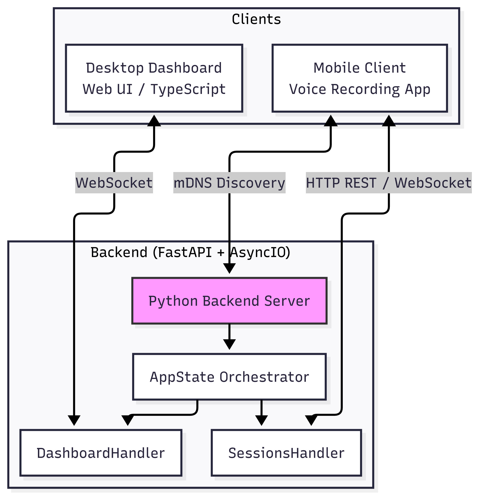
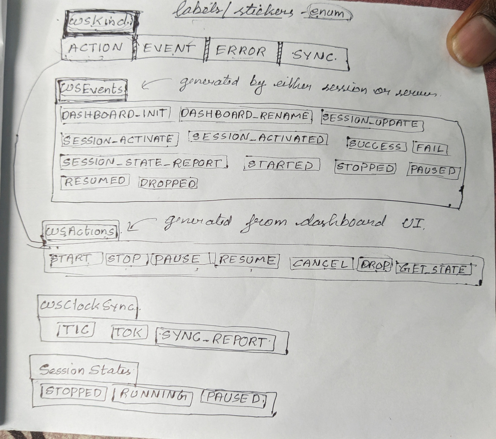
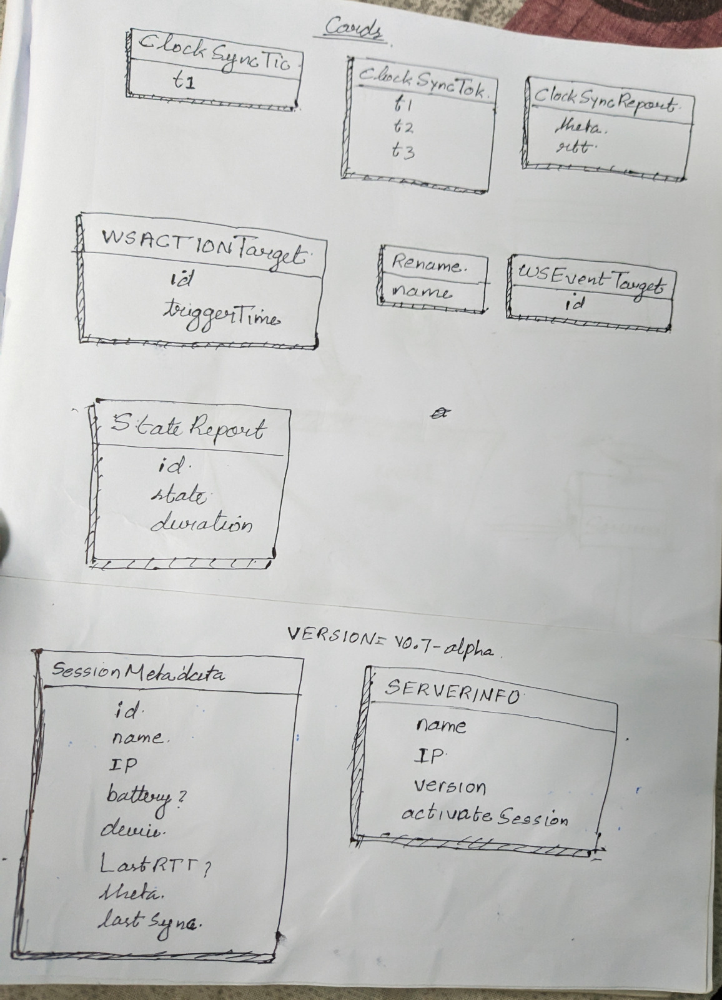
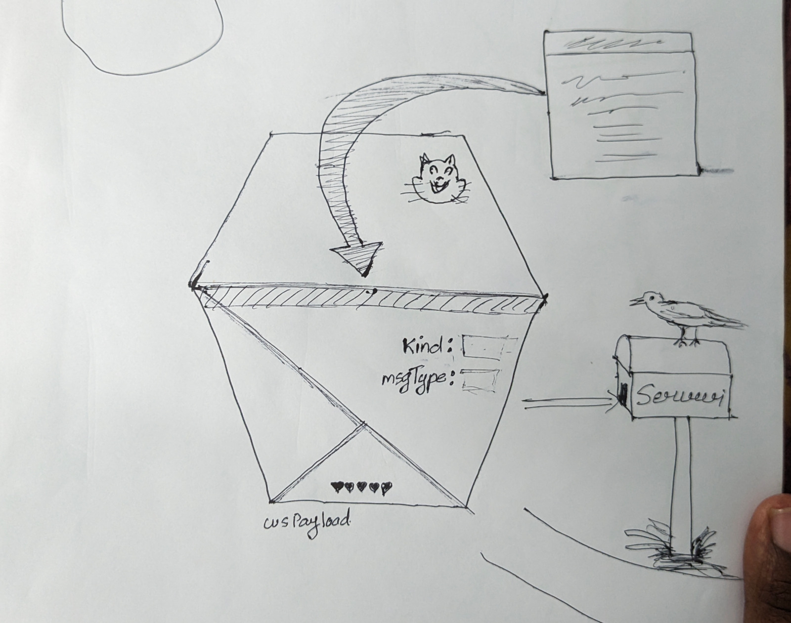
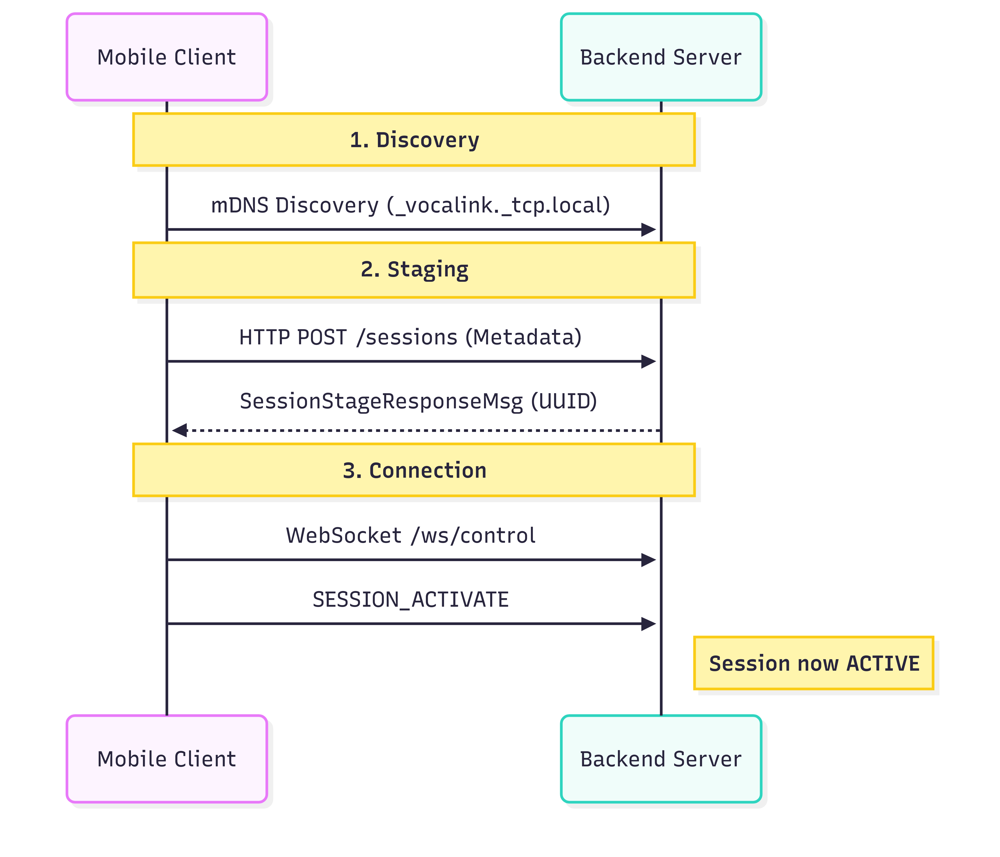
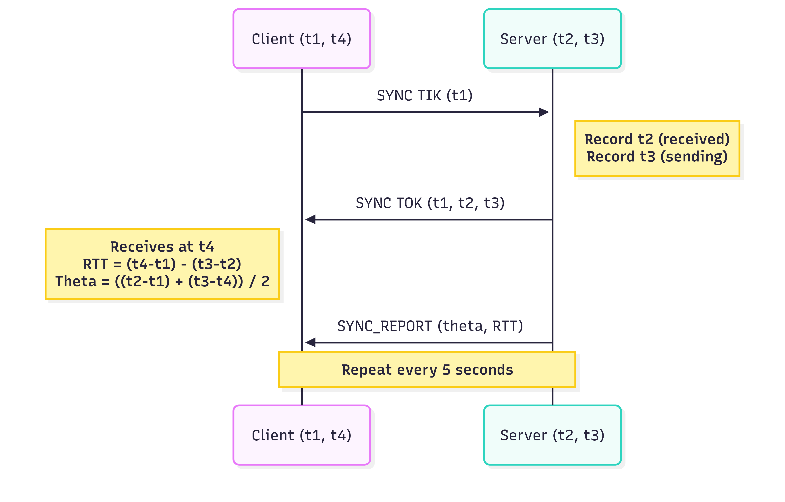
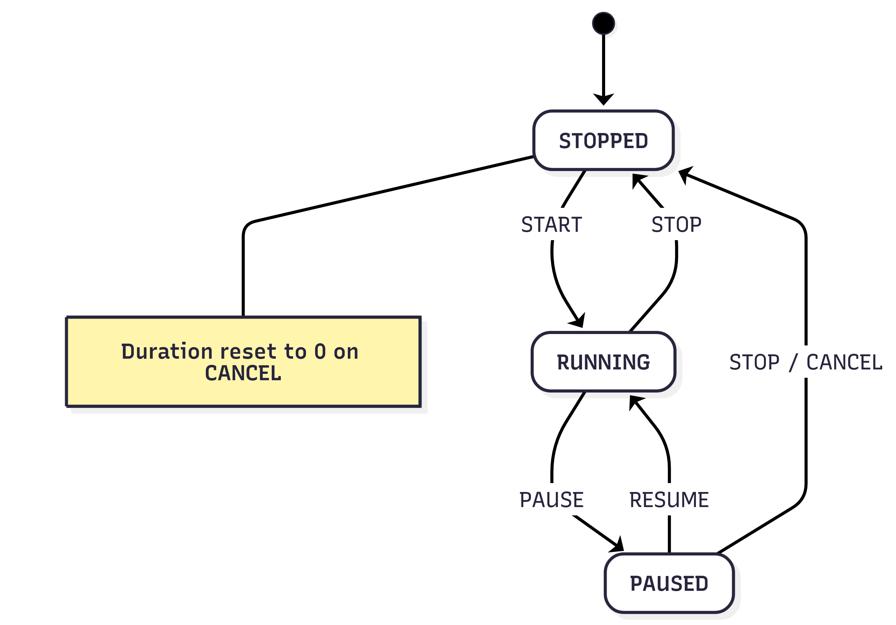
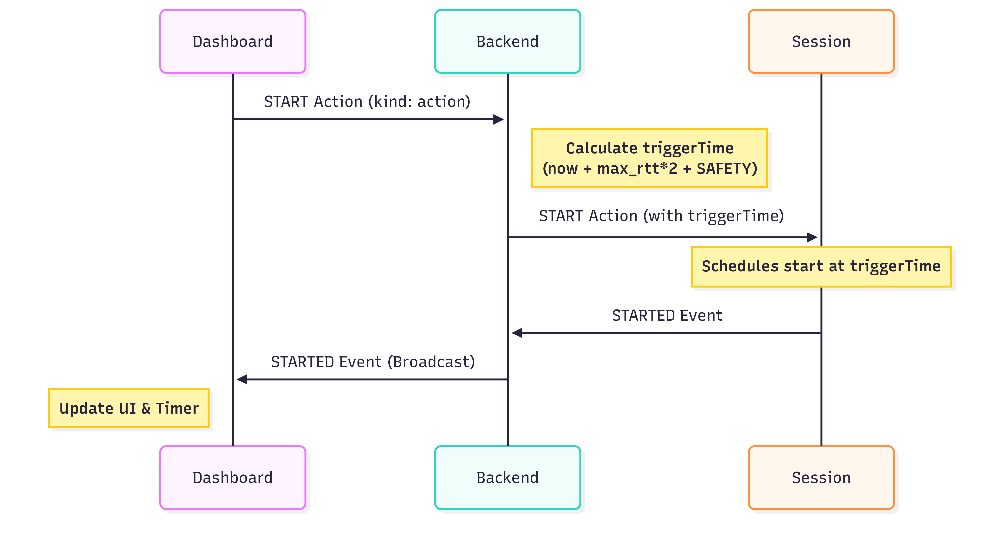

# VocalLink: Project Proposal & System Architecture

## 1. Executive Summary

**VocalLink** is a distributed audio recording system that bridges the gap between autonomous mobile recording and professional studio orchestration. It transforms standard smartphones into remote recording nodes managed by a centralized Python-based dashboard.

### **The Vision**

- **Autonomy:** High-quality standalone recording with local DSP.

- **Orchestration:** Automatic server discovery via mDNS for synchronized multi-device sessions.

- **Intelligence:** Leveraging server-side computational power for deep-learning speech enhancement.

### **Target Audience**

- **Indie Podcasters:** Multi-person sync without the mixer price tag.

- **Journalists:** Field interviews with "instant" studio-grade AI cleaning.

- **Content Creators:** Turning mobile devices into wireless, high-fidelity microphones.

---

## 2. System Architecture Analysis

### **2.1 High-Level Overview**

The system follows a hub-and-spoke model where the Python Backend (FastAPI) acts as the orchestrator for both mobile clients and the administrative web dashboard.

### 2.2 Server Primitives

### **2.3 Communication Workflows**

#### **Session Lifecycle**

The transition from a standalone app to a managed node happens in three phases: Discovery, Staging, and Activation.

#### **Clock Synchronization (The Berkeley Variant)**

To ensure multi-track recordings align perfectly, the system calculates network latency ($RTT$) and clock offset ($\theta$) every 5 seconds.

- **Round Trip Time ($RTT$):** $RTT = (t_4 - t_1) - (t_3 - t_2)$

- **Clock Offset ($\theta$):** $\theta = \frac{(t_2 - t_1) + (t_3 - t_4)}{2}$

---

## 3. Data & State Management

### **3.1 Session State Machine**

The backend maintains the "Source of Truth" for all client states. This prevents "state drift" where the dashboard thinks a phone is recording when it isn't.

### **3.2 Action Flow: Latency Compensation**

When the user clicks "START," the server doesn't just send a command; it calculates a future `triggerTime` based on the slowest device's latency to ensure all phones hit "Record" at the exact same millisecond.

---

## Critical Technical Features

- ✅ **Synchronized Recording:** Millisecond-accurate start times across multiple devices.

- ✅ **Network-Aware Timing:** Dynamic delay calculation based on real-time RTT.

- ✅ **Graceful Degradation:** Automatic cleanup of "Dropped" sessions to prevent UI clutter.

- ✅ **Real-time Metadata:** Live monitoring of battery levels and IP status for all nodes.
