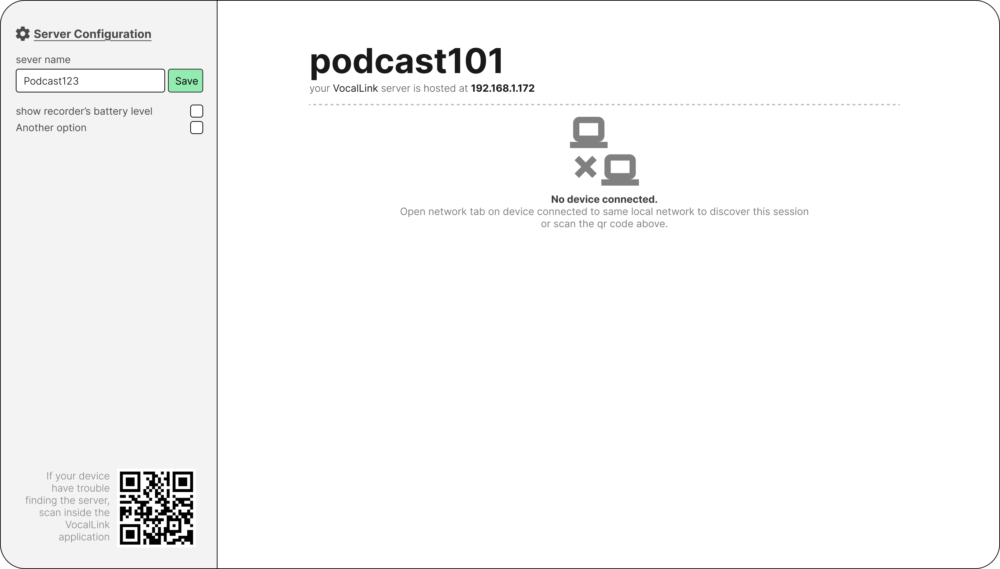

### Table of Contents

1. [Project Proposal](#project-proposal)
2. [Anticipated Communication Architecture](#anticipated-communication-architecture)
3. [UI Mockups](#ui-mockups)
4. [Endpoints](#Endpoints)
5. [Problems to be identified](#Problems-to-be-identified)
6. [Resources](#Resources)

# Project Proposal

## Idea

VocalLink is a distributed audio recording system that functions as a sophisticated standalone mobile voice recorder while offering an enhanced client-server architecture for professional studio environments. Operating autonomously, the smartphone application provides high-quality, noise-cancelled recording for everyday use; however, upon detecting a server via mDNS, it transforms into a remote recording node capable of being managed through a centralized dashboard. This architecture allows a single server to orchestrate multiple mobile clients simultaneously—ideal for multi-speaker scenarios like podcasts or interviews—and leverages the server's superior computational power to apply resource-intensive deep learning algorithms for professional-grade speech enhancement and post-processing.

## Purpose

Our project makes professional audio recording easy and affordable by using the smartphones people already own. In common situations like group podcasts or interviews, it removes the hassle of trying to sync different recordings manually and solves the problem of phones not being powerful enough to handle high-end audio cleaning. By letting a central server control all the phones at once and then using ML to automatically enhance the speech, it turns basic mobile recordings into high-quality files. This gives creators a simple way to get great sound without needing to buy expensive microphones, mixers, or professional studio space. 

## Target Audience

- **Indie Podcasters:** Creators who need synchronized multi-person recordings without costly equipment.

- **Journalists & Researchers:** Professionals who record interviews in the field and enhance them ~~later~~ with AI processing.

- **Content Creators & YouTubers:** Users who want their phones to act as wireless microphones that send audio directly to their editing setup.

- **Educators:** Teachers who need clear recordings for lectures, discussions, and accessibility.

## Useful Situations

- **Multi-Guest Interviews:** Use multiple phones as microphones, controlled from one central dashboard.

- **Noisy Environments:** Remove background noise using server-based deep learning and client's DSP processing.

- **Low-Budget Studios:** Act as a "poor man's recording studio"

- ~~***On-the-Go Recording:** Record anywhere and automatically enhance files when reconnecting to the server.*~~
  
  ---

# Anticipated communication architecture

## server discovery

#### Option 1: mDNS for server discovery

**Multicast DNS** is a computer networking protocol that resolves hostnames to IP addresses within small networks that do not include a local name server. It is a zero-configuration service, using essentially the same programming interfaces, packet formats and operating semantics as unicast Domain Name System (DNS)

#### Option 2: Subnet Scanning

**How it works:**

1. The Recorder (client) identifies its own IP (e.g., `192.168.1.15`).

2. It loops through every IP on that subnet (`192.168.1.1` to `192.168.1.255`).

3. It sends a "ping" (a quick HTTP GET) to `http://[IP]:6210/ping`.

4. The IP's that responds "alive" is identified as the Controllers.

send the pings asyncronously to discover the server faster. **Optimization :** do a light-weight TCP handshake on the ip:port before sending http request.

#### Option 3: using QR code

server displays a qr code containing info about ip address, port number and server's name.

#### Option 4: (Fallback) manually entering IP address

Option 1 and 2 is not garunteed to find the server since some routers interpret the bruite force method as a security attack and blocks the traffic. That's why option 3 exist. If option 3 doesn't work for some reason, manually entering the ip address will be the last resort for establishing connection.

## REST API and WebSockets for communication

After the client discovers server information, it can now use the server's ip address and port number to communicate to that server using predefined **routes**.
A route is a path within our server that essentially leads to a function call. For example, we can define `http://localhost:8000/ping` where **`/ping`** is a route that calls a function that lies on the server to check whether server is alive or not.

**What's REST API ?** It is basically a cool name for http methods - GET, POST, PUT, DELETE ... [read more](https://restfulapi.net/http-methods/)

**Why do we need it ?** everything we will be doing apart from control commands (ie, START_RECORD, STOP_RECORD) will be using REST API methods. 

## What purpose does WebSockets serve in our project?

WebSockets is a communication protocol that enables **two-way** (full-duplex), **real-time** interaction between a client  and a server over a single, persistent connection.
We will be using this technology to enable real time control command transfer and updation. The dataflow will be like the following

1. The user clicks on "Start Recording" button

2. the frontend sends a message to backend via websockets to tell the client to start recording.
   
   ```json
   {
       "action": "START_RECORDING"
   }
   ```

3. The backend broadcast this message to all or specific client(s)

4. each client will recieve this message

5. the client should acknowledge the request back to server.

## Backend

We will be deploying our **backend in python**, due for the following **reasons**.

1. familiarity of team with python code.
2. since we are planning on adding ML based post processing on server
3. Offers a mature ecosystem of libraries for our usecase

| Technology    | Python Library we plan on use |
| ------------- | ----------------------------- |
| WebSockets    | FastAPI                       |
| routing       | FastAPI                       |
| ML processing | librosa/PyTorch               |

---

# UI Mockups

#### Server Dashboard




#### Client's Server Selection Page

<div>
    
    
</div>

> [link to choosen client side application](https://github.com/0x11a41/fossify-voice-recorder#)

---

# Endpoints

#### 1. Server Metadata

| Purpose            | Endpoint      | Method |
| ------------------ | ------------- | ------ |
| Get server info    | `/session`    | GET    |
| Update server name | `/session`    | PATCH  |
| Get QR code        | `/session/qr` | GET    |

Example:

```json
// GET /session
{
  "name": "Podcast101",
  "ip": "192.168.1.172",
  "clients": 3
}
```

#### 2. Client Lifecycle

| Purpose         | Endpoint        | Method |
| --------------- | --------------- | ------ |
| Register client | `/clients`      | POST   |
| List clients    | `/clients`      | GET    |
| Get client info | `/clients/{id}` | GET    |
| Remove client   | `/clients/{id}` | DELETE |
| Rename client   | `/clients/{id}` | PATCH  |

Example:

```json
// POST /clients
{
  "name": "Ester Brown",
  "ip": "192.168.1.132",
  "device": "Pixel 6"
}
```

#### 4. Upload After Recording

| Purpose      | Endpoint      | Method |
| ------------ | ------------- | ------ |
| Upload audio | `/recordings` | POST   |

Payload: multipart/form-data

```
file
client_id
timestamp
session_id
```

#### 5. List & Delete

| Purpose         | Endpoint           | Method |
| --------------- | ------------------ | ------ |
| List recordings | `/recordings`      | GET    |
| Get recording   | `/recordings/{id}` | GET    |
| Delete          | `/recordings/{id}` | DELETE |
| Delete all      | `/recordings`      | DELETE |

#### 6. Enhancement

| Purpose     | Endpoint                   | Method |
| ----------- | -------------------------- | ------ |
| Enhance one | `/recordings/{id}/enhance` | POST   |
| Enhance all | `/recordings/enhance`      | POST   |

Optional body:

```json
{
  "model": "denoise-v2",
  "level": "high"
}
```

#### 7. Streaming & Download

| Purpose  | Endpoint                    | Method |
| -------- | --------------------------- | ------ |
| Stream   | `/recordings/{id}/stream`   | GET    |
| Download | `/recordings/{id}/download` | GET    |

#### 8. Merging / Export

| Purpose         | Endpoint         | Method |
| --------------- | ---------------- | ------ |
| Merge           | `/export/merge`  | POST   |
| Download merged | `/export/latest` | GET    |

#### 9. WebSockets Control Channel

```
/ws/control
```

All commands go through this endpoint.

**Message Format :**

```json
// status
{
  "active": true, 
  "recording": true,
}
```

```json
// record all
{
  "type": "command",
  "target": "all",
  "action": "start_recording"
}
```

```json
// record specific client
{
  "type": "command",
  "target": "client",
  "client_id": 42,
  "action": "stop_recording"
}
```

```json
// State Updates (Client → Server)
{
  "type": "state",
  "client_id": 42,
  "recording": true,
}
```

---

# Problems to be identified

1. **Clock synchronization:** If the server sends a "START" command via WebSocket, Client A might receive it 10ms later, and Client B might receive it 150ms later due to network jitter. When we merge the files, the speakers will be out of sync, creating an echo or "phasing" effect. We need a mechanism to sync clocks (like a simplified NTP) or include a **timestamp** in the metadata of the audio file that records exactly when the "Record" button was triggered in Unix time (milliseconds).

2. **Android development:** This is the unknown territory we will be facing. A lot of LLM generated code will be required.

3. **Speech enhancement:** using ML and DSP-absed processing pipelines

4. **Failures and recovery:** Recovering disconnected recording sessions.

5. **Enhancement processing states:** The `/enhance` endpoint shouldn't just be a POST that hangs. We might need a "status" field in our recording metadata: `[Original, Processing, Enhanced, Failed]`

---

# Resources

- [REST API Introduction - GeeksforGeeks](https://www.geeksforgeeks.org/node-js/rest-api-introduction/)

- [WebSockets - medium.com](https://medium.com/@omargoher/websocket-explained-what-it-is-and-how-it-works-b9eafefe28d7)

- [WebSockets - medium.com](https://javascript.plainenglish.io/websocket-an-in-depth-beginners-guide-96f617c4c7a5)

- [mDNS - medium.com](https://medium.com/@potto_94870/understand-mdns-with-an-example-1e05ef70013b)

#### Research papers

- [Autodirective Audio Capturing Through a
  Synchronized Smartphone Array](https://xyzhang.ucsd.edu/papers/Sur_Wei_MobiSys14_Dia.pdf) - Similar to our project, contains info about clock synchronization problem.

---
