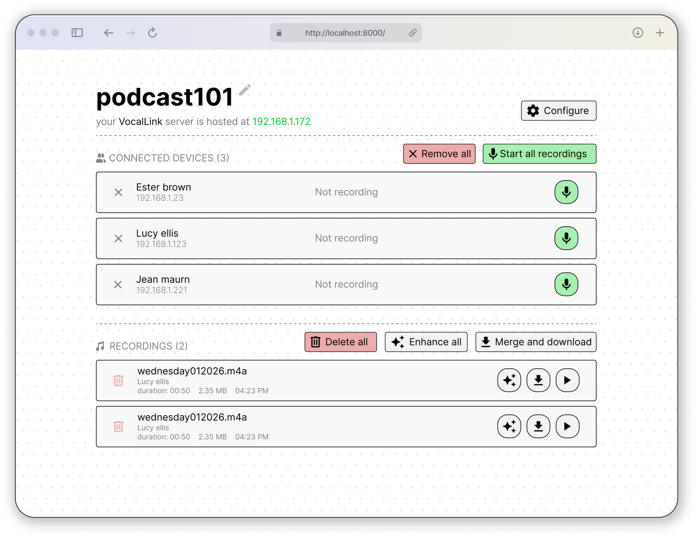
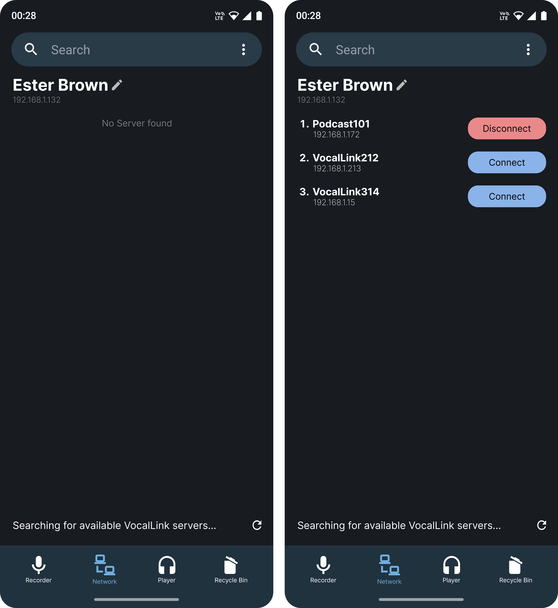

### Table of Contents

1. [Project Proposal](#project-proposal)
2. [UI Mockups](#ui-mockups)
3. [Anticipated Communication Architecture](#anticipated-communication-architecture)
4. [Communication Endpoints](#communication-endpoints)

# Project Proposal

## Idea

VocalLink is a distributed audio recording system that functions as a sophisticated standalone mobile voice recorder while offering an enhanced client-server architecture for professional studio environments. Operating autonomously, the smartphone application provides high-quality, noise-cancelled recording for everyday use; however, upon detecting a server via mDNS, it transforms into a remote recording node capable of being managed through a centralized dashboard. This architecture allows a single server to orchestrate multiple mobile clients simultaneously—ideal for multi-speaker scenarios like podcasts or interviews—and leverages the server's superior computational power to apply resource-intensive deep learning algorithms for professional-grade speech enhancement and post-processing.

## Purpose

Our project makes professional audio recording easy and affordable by using the smartphones people already own. In common situations like group podcasts or interviews, it removes the hassle of trying to sync different recordings manually and solves the problem of phones not being powerful enough to handle high-end audio cleaning. By letting a central server control all the phones at once and then using ML to automatically enhance the speech, it turns basic mobile recordings into high-quality files. This gives creators a simple way to get great sound without needing to buy expensive microphones, mixers, or professional studio space. 

## Target Audience

- **Indie Podcasters:** Individuals who record group sessions and need a way to keep all participants in sync without buying a multi-channel mixer.

- **Journalists and Field Researchers:** Professionals who conduct interviews on the go and need to "fix" recordings later using the server's AI enhancement.

- **Content Creators & YouTubers:** People making videos who want to use their phone as a high-quality wireless microphone that automatically sends files to their editing station.

- **Educators:** Teachers recording lectures or student discussions where clear speech is vital for accessibility and transcription.

## Useful Situations

- **Multi-Guest Interviews:** When you have three or four people in a room, you can give each person a smartphone to use as a "mic" and control them all from one laptop dashboard.

- **Recording in Noisy Places:** If you are forced to record in a cafe or a windy park, the server's deep learning algorithms can strip away the background noise better than a phone ever could.

- **Low-Budget Remote Studios:** It acts as a "poor man's studio," allowing a group of people to create professional-grade multi-track audio without spending thousands on XLR microphones and acoustic foam.

- **Spontaneous Inspiration:** Since the app works as a normal recorder when the server is away, you can capture ideas anywhere and have them automatically "cleaned up" the moment you walk back into your home network.

# UI Mockups

#### Server Dashboard



#### Client's Server Selection Page



>  [link to choosen client side application](https://github.com/0x11a41/fossify-voice-recorder#)

# Anticipated communication architecture

## mDNS for server discovery

clients do not know server's IP address, host name or port number. mDNS is a network advertisement service for local network that multicasts the IP address, host name and port number onto the devices connected to local network periodically. Clients listening on the same multicast channel can discover information that is being brodcasted. 'm' in 'mDNS' stands for multicast.

```
Server
   |
   | mDNS broadcast
   v
---------------------------------
|  Local network (WiFi)         |
---------------------------------
   ^            ^           ^
   |            |           |
 Client A    Client B    Client C
```

Python's **zeroconf** library enables us to use mDNS inside our server. After client's discovery about server's IP address and PORT number, REST API's and WebSockets will tell rest of the story. 

## REST API and WebSockets for communication

After the client discovers server information, it can now use the server's ip address and port number to communicate to that server using predefined **routes**.
A route is a path within our server that essentially leads to a function call. For example, we can define `http://localhost:8000/ping` where **`/ping`** is a route that calls a function that lies on the server to check whether server is alive or not.

**What's REST API ?** It is basically a cool name for http methods - GET, POST, PUT, DELETE ... [read more](https://restfulapi.net/http-methods/)

**Why do we need it ?** everything we will be doing apart from control commands (ie, START_RECORD, STOP_RECORD) will be using REST API methods. 

---

## What purpose does WebSockets serve in our project?

WebSockets is a communication protocol that enables **two-way** (full-duplex), **real-time** interaction between a client  and a server over a single, persistent connection.
We will be using this technology to enable real time control command transfer and updation. The dataflow will be like the following

1. The user clicks on "Start Recording" button

2. the frontend sends a message to backend via websockets to tell the client to start recording.
   
   ```json
   {
       "action": "START_RECORDING"
   }
   ```

3. The backend broadcast this message to all or specific client(s)

4. each client will recieve this message

5. the client should acknowledge the request back to server.

## Backend

We will be deploying our **backend in python**, due for the following **reasons**.

1. familiarity of team with python code.
2. since we are planning on adding ML based post processing on server
3. Offers a mature ecosystem of libraries for our usecase

| Technology    | Python Library we plan on use |
| ------------- | ----------------------------- |
| mDNS          | zeroconf                      |
| WebSockets    | FastAPI                       |
| routing       | FastAPI                       |
| ML processing | librosa/PyTorch               |

# Communication Endpoints

### 1. Client (Mobile App) → Server Routes

| Trigger (UI / Event) | Route                     | Method | Purpose                     | Payload (Summary)            |
| -------------------- | ------------------------- | ------ | --------------------------- | ---------------------------- |
| Connect button       | `/api/clients/register`   | POST   | Register client with server | Client name, IP, device info |
| Disconnect button    | `/api/clients/unregister` | POST   | Remove client from server   | Client ID                    |
| Periodic (heartbeat) | `/api/clients/status`     | POST   | Update recording state      | Client ID, state, battery    |
| Recording stop       | `/api/audio/upload`       | POST   | Upload recorded audio       | Audio file + metadata        |

### 2. Server → Client Control (WebSocket)

| Trigger (Dashboard)    | Channel             | Message Type      | Action                 |
| ---------------------- | ------------------- | ----------------- | ---------------------- |
| Start all / mic button | `/ws/control`       | `START_RECORDING` | Begin recording        |
| Stop button            | `/ws/control`       | `STOP_RECORDING`  | Stop recording         |
| Client event           | `/ws/control`       | `STATE_UPDATE`    | Update dashboard state |
| Server name change     | `/ws/server-rename` | `SERVER_RENAME`   | Rename server          |
| Rename client          | `/ws/client-rename` | `CLIENT_RENAME`   | Rename client          |

### 3. Server Dashboard – Device Control Routes

| UI Element            | Route                       | Method | Purpose                |
| --------------------- | --------------------------- | ------ | ---------------------- |
| Header section        | `/api/server/info`          | GET    | Fetch server name & IP |
| Device list           | `/api/clients`              | GET    | List connected clients |
| Start all recordings  | `/api/control/start-all`    | POST   | Start all clients      |
| Stop all recordings   | `/api/control/stop-all`     | POST   | Stop all clients       |
| Individual mic button | `/api/control/client/start` | POST   | Start single client    |
| Individual stop       | `/api/control/client/stop`  | POST   | Stop single client     |
| X button              | `/api/clients/remove`       | POST   | Remove client          |

### 4. Recordings Management Routes

| UI Element       | Route                                  | Method | Function               |
| ---------------- | -------------------------------------- | ------ | ---------------------- |
| Recordings list  | `/api/recordings`                      | GET    | List all recordings    |
| Trash icon       | `/api/recordings/{id}`                 | DELETE | Delete recording       |
| Delete all       | `/api/recordings`                      | DELETE | Remove all recordings  |
| ✨ button         | `/api/recordings/{id}/enhance`         | POST   | Enhance recording      |
| Enhance all      | `/api/recordings/enhance-all`          | POST   | Enhance all recordings |
| Play button      | `/api/recordings/{id}/stream`          | GET    | Stream audio           |
| Merge & download | `/api/recordings/merge`                | POST   | Merge all audio        |
| Download         | `/api/recordings/merged/{session}.wav` | GET    | Download merged file   |

### 5. Discovery (Non-HTTP)

| Mechanism            | Purpose                              |
| -------------------- | ------------------------------------ |
| mDNS / UDP broadcast | Discover available VocalLink servers |
